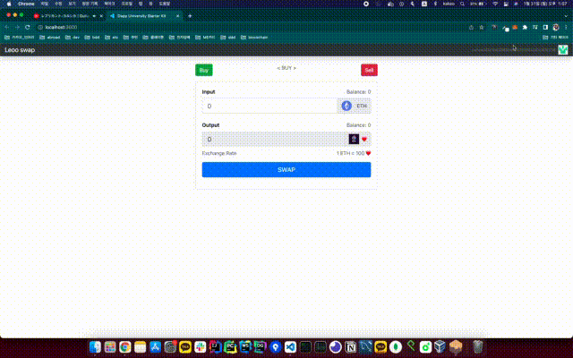

# Cryptocurrency

> [refs](https://youtube.com/playlist?list=PLS5SEs8ZftgXHEtZ19lXmDQZm_1JKaBTK)

- This is simple ethereum based swap web site, which can exchange `ether` <-> `LoveToken`.
- LoveToken is a custom token impl of [eip-20](https://github.com/ethereum/EIPs/blob/master/EIPS/eip-20.md) protocol.

## preview

> [origin .mov file link](./static/swap.mov)

<p align="center">
  
</p>

## dependices

- [Node.js](https://nodejs.org/en/)
- [Ganache](https://www.trufflesuite.com/ganache)
- [Truffle](https://www.trufflesuite.com/)
- [Metamask](https://metamask.io/)
- [starter kit](https://github.com/dappuniversity/starter_kit)
- [identicon.js](https://github.com/stewartlord/identicon.js)

## setup

1. install metamask
2. install ganache
   - start ganache (port :8545)
3. install truffle

```console
$ npm install -g truffle
$ truffle version
Truffle v5.4.30 (core: 5.4.30)
Solidity v0.5.16 (solc-js)
Node v14.15.1
Web3.js v1.5.3
```

4. npm init

```console
$ npm init
```

5. test & migrate

```console
$ truffle test
$ truffle migrate --reset
```

6. npm start

```
$ npm run start

open http://localhost:3000
```

## before swap

> [origin .mov file link](./static/local_setup.mov)

This is about how to setup ganache and metamask account's eth balance.

<p align="center">
  
</p>
